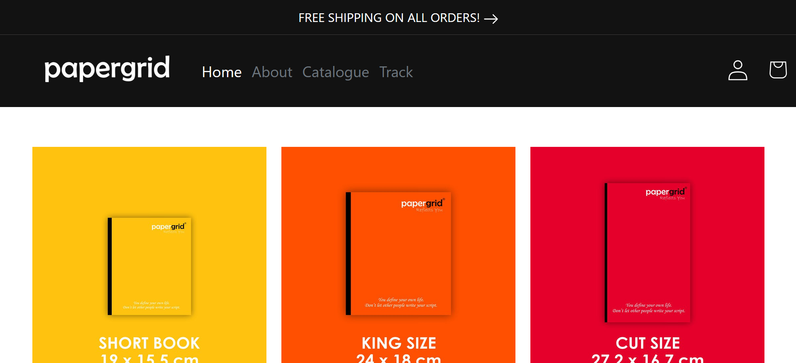

# PaperGrid Responsive Website

A responsive multi-page website built using **HTML5**, **CSS3**, and **Bootstrap 5**. This project was created to practice responsive web design, Bootstrap components, and modern front-end development by building a clean and professional website layout.

> **Disclaimer:** This project is developed for educational purposes as part of my front-end web development learning journey.

---

## Live Demo

🌐 https://najmudheenpk.github.io/papergrid-responsive-website/

---

## Screenshot



---

## Features

- Fully responsive design
- Modern landing page
- Responsive navigation bar
- Hero section
- Services section
- About section
- Contact section
- Bootstrap Grid System
- Bootstrap components
- Mobile-friendly layout
- Clean and modern user interface

---

## Technologies Used

- HTML5
- CSS3
- Bootstrap 5

---

## Project Structure

```
papergrid-responsive-website/
│
├── index.html
├── style.css
├── papergrid-responsive-website.png
└── README.md
```

## What I Learned

- Responsive web design principles
- Bootstrap 5 Grid System
- Bootstrap components and utilities
- Semantic HTML structure
- CSS customization
- Mobile-first development
- Building professional multi-page websites
- Organizing front-end project files

---

## Author

**Najmudheen PK**

GitHub: https://github.com/najmudheenpk
